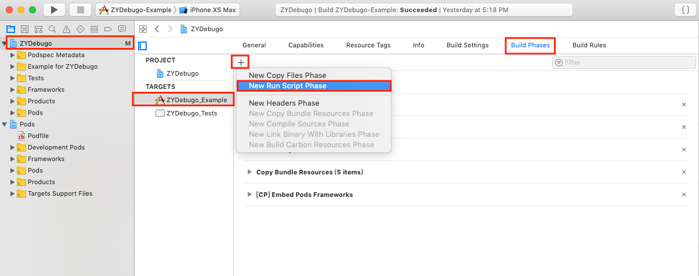
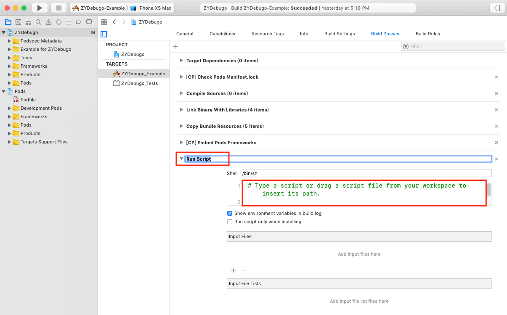

# 获取 Build 信息

如果你想实现以下功能：

* 获取安装包 build 时间
* 获取 build 安装包的电脑 hostname、UUID
* 获取当前代码的 git 分支以及最后一次 commit 信息等

那么你需要添加脚本到工程中，具体如下

1. 在 TARGETS 选中当前工程
2. 选中 Build Phases
3. 点击左上方 ✚ 号
4. 选中 New Run Script Phase

	
5. 建议将新建的 `Run Script` 更名为 `Debugo Build Info`

	
6. 展开这个选项，将 shell 脚本粘贴到输入框，保存即可

其中最后一步有两个脚本可以选择，各有优势，建议使用脚本1~ 😀

### 脚本1

```bash
# direct drag / pod no use_frameworks!
buildInfoSh="${BUILT_PRODUCTS_DIR}/${EXECUTABLE_FOLDER_PATH}/Debugo.bundle/com.ripperhe.debugo.build.info.sh"
# pod use_frameworks!
buildInfoSh2="${BUILT_PRODUCTS_DIR}/${EXECUTABLE_FOLDER_PATH}/Frameworks/Debugo.framework/Debugo.bundle/com.ripperhe.debugo.build.info.sh"

if [ -x "${buildInfoSh}" ]; then
${buildInfoSh}
echo "com.ripperhe.debugo.build.info.sh path: ${buildInfoSh}"
elif [ -x "${buildInfoSh2}" ]; then
${buildInfoSh2}
echo "com.ripperhe.debugo.build.info.sh path: ${buildInfoSh2}"
else
echo "com.ripperhe.debugo.build.info.sh not found!!! "
fi
```

* **优点** 内部直接调用脚本2，脚本2是放在仓库内部的，如果后期脚本2需要更新，脚本2会随着仓库自动更新，无需再手动配置
* **缺点** 因为是从 budle 中获取脚本进行执行，所以第一次 build 的时候获取不到脚本，从第二次开始正常，个人认为不影响操作，不过需要知道这个点

### 脚本2

如果使用脚本1的时候，build 信息中总是提示 `com.ripperhe.debugo.build.info.sh not found!!! `，那就直接粘贴下面这个脚本到输入框

* **优点** 因为脚本2的内容就是真正要执行的，不引用其他脚本，直接粘贴到输入框肯定每次都能执行
* **缺点** 如果后期本仓库升级脚本，需要手动重新复制粘贴

[跳转到脚本文件链接 🚀](https://github.com/ripperhe/Debugo/blob/master/Debugo/Plugin/DGBase/Assets/Debugo.bundle/com.ripperhe.debugo.build.info.sh)
